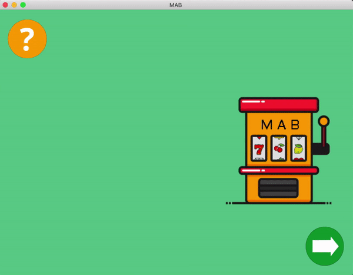
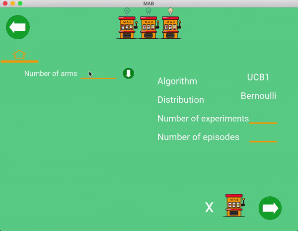

# MAB
Representation of The Multi-Armed Bandit Problem

The multi-armed bandit problem is a classic problem that well demonstrates the exploration vs exploitation dilemma. You can imagine you are in a casino facing multiple slot machines and each is configured with an unknown probability of how likely you can get a reward at one play. The question is: What is the best strategy to achieve highest long-term rewards?

The exploration vs exploitation dilemma exists in many aspects of our life. Say, your favorite restaurant is right around the corner. If you go there every day, you would be confident of what you will get, but miss the chances of discovering an even better option. If you try new places all the time, very likely you are gonna have to eat unpleasant food from time to time. Similarly, online advisors try to balance between the known most attractive ads and the new ads that might be even more successful.

The dilemma comes from the incomplete information: we need to gather enough information to make best overall decisions while keeping the risk under control. With exploitation, we take advantage of the best option we know. With exploration, we take some risk to collect information about unknown options. The best long-term strategy may involve short-term sacrifices. For example, one exploration trial could be a total failure, but it warns us of not taking that action too often in the future.

